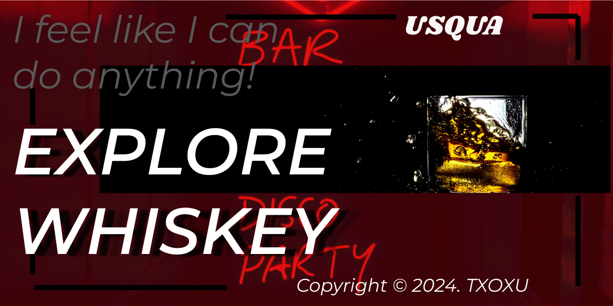
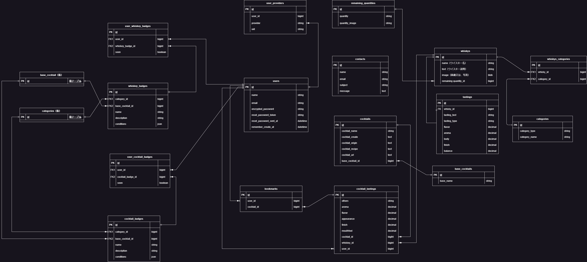

# 【USQUA】（ウスカ）
   
   

# 目次
- [【USQUA】（ウスカ）](#usquaウスカ)
- [目次](#目次)
- [サービス概要](#サービス概要)
- [サービスURL](#サービスurl)
    - [https://usqua-b00a6d1e8961.herokuapp.com/](#httpsusqua-b00a6d1e8961herokuappcom)
- [このサービスへの思い・作りたい理由](#このサービスへの思い作りたい理由)
- [機能紹介](#機能紹介)
- [技術構成](#技術構成)
  - [使用技術](#使用技術)
  - [画面遷移図](#画面遷移図)
  - [ER図](#er図)
  - [今後の実装](#今後の実装)

# サービス概要
  自宅にあるウイスキーをオンライン上でも保管し、テイスティングノート（テイスティング評価）や残りの量、銘柄を外出先でもチェックできる。また、カクテル一覧、蒸留所一覧も用意しているので、探求できるウイスキー管理＆探求アプリ。
   

# サービスURL
### https://usqua-b00a6d1e8961.herokuapp.com/ 
 

# このサービスへの思い・作りたい理由
  ずっとウイスキーを愛飲してきたあなたが、コレクションが増えていくにつれ、自分がどんな銘柄を持っているのか、どのウイスキーが残っているのかを把握するのが次第に難しくなってきました。コレクションの中には、きれいな箱や筒で保管されているものも多く、いざ確認しようとすると一本一本を取り出して見て回らなければならず、その作業も次第に億劫になってきたのです。
   
  そんなとき、ふと考えました。もしこのコレクションをオンライン上で管理できれば、いつでもどこでも自分の手元にあるウイスキーの情報を確認できるのではないか、と。そして、出先でもお気に入りのウイスキーについて調べたり、購入したい銘柄と照らし合わせたりできれば、とても便利に違いないと感じたのです。
   
  このアプリ「USQUA」は、そんな思いから生まれました。ウイスキーを通じて新しい発見や学びを楽しみたいという気持ちも強く、同時に同じようなニーズを持つ他のウイスキー愛好家と共有したいと考えています。これからもウイスキー探求の旅を続けながら、アプリを通じてより深く、ウイスキーの世界に触れていきたいと思っています。
   

# 機能紹介
| ユーザー登録　/ ログイン |
| :---: |
||
| 
「名前」「メールアドレス」「パスワード」を入力してユーザー登録を行います。また、googleログインを行うこともできます。
 |
 

|マイページ|
| :---: |
||
| 
ウイスキーの種類ごとにグラフで分析することができます。また、お気に入り登録したカクテルも確認することができます
 |
 

|ウイスキーを登録|
| :---: |
||
| 
ウイスキーを登録する際に実際の画像又は量の画像を使用して実際の量を登録することができます。（どちらも設定が可能）
|
 

|ウイスキー/カクテルテイスティング登録|
| :---: |
||
| 
5つの5段階評価で登録することもできます。
|
 

|ウイスキー一覧|
| :---: |
||
| 
登録したウイスキーやテイスティングの記録も確認できます。
|
 

|カクテル一覧/詳細|
| :---: |
||
| 
テイスティングの記録も確認できます。詳細ページではYoutubeで作り方を動画で確認できます
|
 

|蒸留所一覧|
| :---: |
||
| 
googleマップで蒸留所の場所を確認できます。
|
 

# 技術構成

## 使用技術
| カテゴリ | 技術 |
| --- | --- |
| サーバーサイド | Ruby on Rails / Ruby |
| フロントエンド | JavaScript |
| CSSフレームワーク | Bootstrap |
| web API | Google API |
| データベース | MYSQL |
| アプリケーションサーバー | Heroku |
| コンテナ管理 | docker |
| バージョン管理ツール | GitHub |
 

## 画面遷移図
https://www.figma.com/file/HVdmhaA0lOg1dRpmfNnEVA/%E3%82%A6%E3%82%A4%E3%82%B9%E3%82%AD%E3%83%BC%E7%AE%A1%E7%90%86%E3%82%A2%E3%83%97%E3%83%AA%E7%94%BB%E9%9D%A2%E9%81%B7%E7%A7%BB%E5%9B%B3?type=design&node-id=31%3A240&mode=design&t=302tnJpZ2UlXOmkz-1
 

## ER図

## 今後の実装
- リポジトリ（uisce-beatha-demo）にフロントエンドにreact, next.js、バックエンドにrailsという構成で機能面、UI面に改良を加えて再開発
- 新機能候補
  ・userにオススメのウイスキーをaiに提案してもらう機能
  ・量の管理をreact.motion（仮）を使用して量の管理をよりリアルにする
- 取り除く機能候補
  ・蒸留所ページ
- 画面構成
  モーダル、コンポーネントを活用し画面遷移を以前よりも少なく実装する
- 対象デバイス
　スマホ
